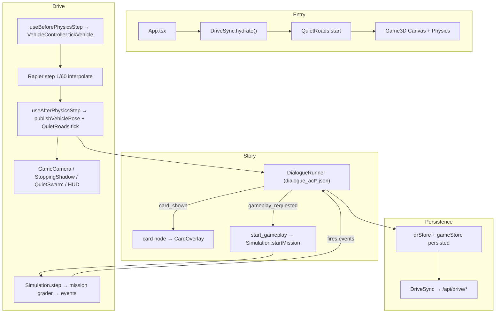

# AUDIT — Quiet Roads (the /drive 3D game)

Phase 1 reconnaissance, 2026-09-30. Branch `agent/overhaul-2026-09-30`.

Scope: the 3D teaching drive at `/drive` (repo: `drive/`, built into
`public/game/drive`). The card game at `/` and the backend are out of scope
(HARD RULE 2). Source of truth for teaching: `docs/wa-driver-guide/`.

---

## 1. Architecture

```
drive/src/
  main.tsx ─▶ App.tsx (auth + DriveSync.hydrate) ─▶ ZombieRoadWarrior ─▶ Game3D
  Game3D.tsx         Canvas (dpr [1,1.5], fov 75) + <Physics gravity=-9.71,
                     timeStep=1/60, interpolate> ─▶ Scene (KentWorld/RoadChunks,
                     Vehicle, GameCamera, TrafficRenderer, QuietSwarm,
                     StoppingShadow, HeadlightBeam, …) + HTML overlays
  quietroads/
    data/*.json      cards.json (122), dialogue_act*.json, questions_v1/2/3
    dialogue/        DialogueRunner (trigger/wait/card/branch node engine),
                     host.ts (DialogueHost iface), types.ts
    sim/             Simulation (mission router + world stepper) +
                     graders: dol, grid, ledger, ribbon, convoy, climb, rural,
                     beats, escort, chainup, pharmacy; quiet.ts (swarm),
                     noise.ts (sound falloff), vehicleObserver.ts (shadow/slip),
                     kentMap.ts + corridors.ts (geometry)
    study/           QuestionBank, SM-2 mastery, exam_40, CardDeck, CARD_FOR_TRIGGER
    actChallenges.ts  act↔scene↔mission registry (ACT_CHALLENGES, SCENE_ACT, MISSION_ACT)
  stores/            gameStore (vehicle/game, zustand+persist), qrStore (story
                     progress, persisted), qrHud (transient HUD + telemetry)
  systems/           QuietRoadsBridge (singleton: dialogue↔sim↔store↔server),
                     VehicleController (arcade setLinvel/angvel), TrafficManager
                     (highway NPCs), AudioManager, DriveSync, QuizManager,
                     RoadChunkManager, StepEventQueue, headlights, physicsStep
  input/             driveInput.ts (key/gamepad/touch merge)
  hooks/             useTouchControls, useQuiz, useGameProgress, useCompactHud
```

### Execution model

- **Physics** is Rapier on a fixed 1/60 s step with `interpolate`. The car is a
  `RigidBody` (mass 1200, `ccd`, `enabledRotations=[false,true,false]`,
  `colliders=false`) with a single `CuboidCollider` of `friction=0`. Motion is
  programmatic: `VehicleController.tickVehicle` runs in `useBeforePhysicsStep`
  and writes `setLinvel`/`setAngvel`; `publishVehiclePose` runs in
  `useAfterPhysicsStep` and writes one coherent snapshot to `gameStore`.
- **Story** is dialogue-file driven. `DialogueRunner` executes `line/wait/card/
  branch/choice/jump/end` nodes and fires/receives events. A `card` node shows a
  PINK MENACE card; a `start_gameplay` effect hands control to `Simulation`.
- **Missions** are pure graders. `Simulation.step(dt, sample)` feeds a
  `VehicleSample` to the active mission grader, which emits `*` events the
  dialogue waits on. Graders do not drive the car.
- **HUD** updates at ~10 Hz. `qrHud.frame` and the store copy of
  `velocityMph`/`engineRPM` are both throttled. Camera, audio, and wheel spin
  read `liveDrive`, which updates every physics step.



---

## 2. Card → trigger → grade, per act

Legend: **DIALOG** = a `card` node in a dialogue scene (type in parentheses);
**TRIG** = an in-world `CARD_FOR_TRIGGER` event fired by a sim grader while
driving; **—** = never opened in the drive (briefing-only / card host).

### Act I — The Lot (12/12 wired) ✓ reference model
- DIALOG: 0.2 gameplay → I-002, I-003, I-004 · 0.3 radio → I-001 ·
  1.2 gameplay → I-005, I-009 · 1.3 gameplay → I-006, I-007, I-008, I-010 ·
  1.4 still → I-011 · 1.4b still → I-012
- Grades: `tutorial_carport`, `mission_dol_drive`, `minigame_park_dol`
  (`park.clean`/`park.curb`), `stealth_dol_interior` + `chase_dol_gracie` (QTE).

### Act II — The Grid (11/31 wired)
- DIALOG: II-001, II-004, II-024 (gameplay); II-006, II-012 (still)
- TRIG: II-002 `sign.prompt:school`, II-003 `sign.prompt:regulatory`,
  II-005 `backing.mirror`, II-006 `signal.arm`, II-010 `bus.stop_arm`,
  II-012 `follow.close`, II-024 `stop.approach`, II-027 `zone.school.enter`,
  II-030 `driveway.turn`
- Grades: `mission_delivery_1_insulin`/`dropoff_pharmacy`,
  `mission_delivery_2_catfood` (`park.back_in.*`), `mission_delivery_3_radio`
  (`lanechange.*`), `mission_delivery_4_filters` (`park.parallel.*`),
  `mission_jonah_intersection` (`jonah.blowthrough`, `stop.approach`, `follow.close`)
- **Cued in-scene (20):** II-007, II-008, II-009, II-011, II-013, II-014, II-015,
  II-016, II-017, II-018, II-019, II-020, II-021, II-022, II-023, II-025,
  II-026, II-028, II-029, II-031. `CardCues` fires `card.cue:<id>` on the Grid
  beat that practises the skill; the bridge opens one card at a time.

### Act III — Central (7/31 wired)
- DIALOG: III-002, III-003, III-004, III-006 (2.5 gameplay); III-007 (3.2); III-016, III-020 (6.2)
- Grades: `mission_central_ledger` (`ledger.lanechange.clean|no_signal`,
  `ledger.crossed_solid`, `ledger.wrong_lane`, `ledger.follow.start`,
  `ledger.follow.close`, `ledger.alongside`, `ledger.pass.clear`,
  `ledger.wet.enter`, `ledger.rumble.ride`, `ledger.merge.*`)
- **Cued in-scene (23):** III-001, III-005, III-008, III-009, III-010, III-011,
  III-012, III-013, III-014, III-015, III-017, III-018, III-019, III-021,
  III-022, III-023, III-024, III-025, III-026, III-027, III-028, III-029, III-030.
  (The earlier "24" count listed 23 ids.) South of `solidY` the Ledger is wet,
  so III-024's rain stretch lengthens the stopping shadow.
- **No Act III card is on a timer or a bare coordinate any more.** Four beats were
  added to `LedgerRun` for this: `alongside` (out of his mirrors, §4.4),
  `pass.clear` (his whole front back in the mirror, §5.2), `wet.enter` (south of
  the solid white, §5.6) and `rumble.ride` (riding the line, a soft tyre, §2.5).
  `test/teaching.test.ts` drives each and asserts the card does **not** appear on
  a drive that skips the beat.

### Act IV — The Core (1/22 wired by card node; exam otherwise)
- DIALOG: IV-018 (4.2 exam). The act is `study_terminal` (10 questions) →
  `exam_40` (40 questions, 32 to pass) → `local_loop_week`.
- **Not wired (21):** IV-001-brake, IV-002…IV-017, IV-026…IV-030 (IV stills live
  in the card game; only IV-018 opens inside the drive).
- **P11 closed:** the id stays `IV-001-brake` because the deck, the image route
  (`/api/drive/image/IV-001-brake`) and the coverage test all use it; no loader
  or id check rejects the suffix, so no code change was needed.

### Act V — The Ribbon (8/13 wired)
- DIALOG: V-001, V-003, V-005 (3.2); V-006 (7.1); V-007, V-010, V-012 (3.1b); V-013 (3.3)
- Grades: `mission_ribbon_merge` (`ribbon.*`), `mission_convoy_issaquah`
  (`merge.*`, `follow.green|red`), `chainup_qte`, `climb_snoqualmie`
  (`ice.enter`, `speed.over:35`, `input.gentle_streak`, `skid.worsening`)
- **Cued in-scene (5):** V-002, V-004 (`ramp.enter`), V-008 (on the ramp),
  V-009, V-011 (`ribbon.merge` / `merge.gap_open`).

### Act VI — The Backcountry (9/13 wired)
- DIALOG: VI-001, VI-002, VI-004, VI-006, VI-010, VI-012 (6.1b)
- TRIG: VI-007, VI-008 `roundabout.approach`
- Grades: `mission_backcountry_run` (`rural.shoulder`, `rural.crest.*`,
  `rural.uncontrolled.*`, `rural.crossbuck.*`, `roundabout.*`), `straight_night_drive`,
  `vantage_bridge_crossing`, `bridge_*`, `escort_ritzville` (`nozone.*`, `moveover.*`)
- **Cued in-scene (5):** VI-003 (`rural.edge` — the gravel EDGE, fired while the
  car is still on the road; it used to open on `rural.shoulder` / `nozone.enter`,
  i.e. only after leaving the pavement), VI-005 (crest or wide turn), VI-009
  (uncontrolled), VI-011 (crossbuck), VI-013 (rural end or
  Ritzville). The earlier "(4)" counted these five ids.

---

## 3. Problems found (tagged: area · severity S1–S4 · effort S/M/L)

| # | Area | Sev | Effort | Finding (evidence) |
|---|---|---|---|---|
| P1 | Teaching | S1 | S | **Following distance — resolved.** Graders read `followFullGapM` (`config.ts`). Default feel is still 3 s dry / 4 s truck. `FOLLOW.rule = "vehicle_lengths"` grades §5.2 literally (8 m / 14 m). Cards II-012, V-012, II-014 and the mission objectives lead with the guide's sentence. |
| P2 | Teaching | S2 | S | **Surface friction — resolved for gravel and the Ledger rain stretch.** Gravel μ 0.5 on the backcountry and escort (beetle 55 mph stop 89.8 m). Wet μ 0.4 south of `ledger.solidY` (beetle wet 103.0 m). Ice stays 264.4 m. |
| P3 | UX | S2 | M | **Act select — done, and it works.** `MainMenu.tsx` offers CONTINUE / START NEW RUN and the Acts I–VI list from `ACT_ENTRY`. It was also **broken**: `Bridge.open()` asked `runner.hasScene(which)` *before* loading the act, so every entry not already in the entry chunk fell through to `0.1`. It now resolves the requested id and routes through `sceneRouter`, and `startAct` starts `2.1` / `2.5` / `4.1` / `3.1b` / `6.1b`. Bundle: act dialogue is a per-act dynamic import (`actDialogue.ts`, Act I eager), the act owning the current scene's `next_scene` preloads during the debrief, act-scoped geometries/materials are disposed on an act change while shared highway chunks survive, and the WebGL context-loss edges are a pure function in `systems/glContext.ts`. |
| P4 | Story | S2 | L | **Unwired cards — cued, and on the right beat.** The 20/23/5/5 cards in §2 open from `CardCues` while that act's mission is running; the bridge queues them and shows one at a time. Eight of them were on a timer or a bare coordinate (II-012, III-005, III-009, II-019, II-025, II-026, III-008, VI-003); each is now on the beat that practises it, with a two-sided test. |
| P5 | Perf | S2 | M | **HUD speed/RPM — throttled.** `liveDrive` updates every physics step for camera, audio, and wheel spin. `publishVehiclePose` copies mph/RPM into `gameStore` at 10 Hz. Pose still publishes every step. |
| P6 | Latency | S2 | M | **WebGL context-loss — handled.** `Game3D.GLContextGuard` pauses on `webglcontextlost` (preserving `prePausePhase`), shows a resume prompt, and on restore re-applies the tier's pixel ratio once, clears the toast, and never auto-unpauses. A second loss cannot clobber `prePausePhase` (`systems/glContext.ts`, tested). |
| P7 | Perf/Script | S2 | M | **Test runner — done.** Vitest (151 tests, 14 files) + Playwright smoke + the deterministic bench, wired to `npm test` / `npm run bench`. |
| P8 | Graphics | S2 | M | **Quality tiers — done, and the two defects closed.** `utils/performance.ts` holds a pure `stepQuality` reducer (frame time → high/mid/low) plus the per-tier effect table and `dprForTier`. `PostProcessing` takes a `tier` and mounts only that tier's effects; mobile DPR never exceeds 1.5. Two fixes on top: **(a) one DPR writer** — drei's `<AdaptiveDpr>` (and a no-op `<PerformanceMonitor>`) were mounted beside the Canvas `dpr` prop and called R3F's `setDpr()` on their own schedule; both are gone, and `GLContextGuard` re-applies the tier's ratio once on a context restore. **(b) a 30 Hz panel could not climb back** — the reducer demoted over 33.4 ms but required under 18.2 ms to recover, and a display locked at 30 Hz can never produce an 18.2 ms frame, so one stall pinned it at `low` forever. There is now one threshold (slow = over `SLOW_FRAME_MS`, recovered = not slow), which leaves the high → mid → low reducer and its hold times untouched. Draw calls are sampled from the Kent scene pass, not the postprocessing blit (§5). |
| P9 | Physics | S2 | M | **CCD telemetry — done, and now falsifiable.** `CCD` in `quietroads/config.ts` names the displacement threshold (1.5 m per 1/60 s step); `VehicleObserver` fires one `ccd.tunnel` through the existing telemetry path when a contact-free step moved further. The old headline — "zero tunnels at top speed" — could not fail: a top-speed 1/60 step covers ~0.55 m against a 1.5 m threshold. `test/ccd.test.ts` now asserts a step *larger* than the threshold emits `ccd.tunnel`, that a legal 1/60 step at top speed does not, and that the margin is wide; the four-surface lap remains as a regression net. Stopping distances unchanged. |
| P10 | Data | S3 | S | **`art-review-state` — stripped from the client deck.** The review file stays at `cards/art-review-state.json`. |
| P11 | Data | S3 | S | **`IV-001-brake` non-standard card id — closed.** The id stays: the deck, the image route and the coverage test all use it, and nothing rejects the suffix. No code change. |
| P12 | UX/a11y | S3 | M | **Accessibility — done.** Reduced motion (earlier pass) plus, in `drive/src/input/driveInput.ts`, a persisted `binds` table (defaults are the shipped arrows/WASD set) that `mergeDriveInput` reads; `input/textSize.ts` three persisted steps applied to dialogue, card and HUD type as a CSS variable; and a `colorblindHud` flag whose cue (PASS/MISS word + ✓/✕ shape) rides on the grade result. Spoken lines: every `line` node already has text, so `DialogueBox` was left alone. |
| P13 | Perf | S3 | M | **Per-frame allocations — done.** `vehicleObserver.ts` copies into one owned previous-sample object instead of `{ ...s }`; `Simulation` reuses its ObserverOut, SimFrame, CueProbe and `blocked` closure; `ZoneField` ping-pongs two owned position buffers; the bridge reuses its sample and walker-input objects. Identity contract locked in `test/alloc.test.ts`. |
| P14 | Graphics | S3 | M | **Kent draw merge — done.** `sim/instancing.ts` batches the repeated plain buildings into one InstancedMesh per material (42 → 4 batches) and the dashes into one per colour; `ContinuousRoad` batches the segment meshes the same way. Colliders are untouched: one fixed CuboidCollider per building and one per solid segment. DOL/PHARMACY/WAREHOUSE keep their own components. |
| P15 | Story | S3 | S | **II-006 / II-012 on the road — done.** The two card nodes left the Act V briefing still (3.1 points at 3.1.2 / 3.1.5 now); `CardCues` takes II-006 on the signal beat, and II-012 / III-005 / III-009 on `ledger.follow.start` — the follow beat **beginning**, not the `follow.close` grade they used to hang off, which meant holding the gap correctly never showed them. |
| P16 | Story | S3 | M | **Deac never drove the line his own card describes — done.** III-001 "Your Wheel" is hand-written (`pack/00_README.md`), and it has him *"sweep the glass, hold the lane, then take one merge late on purpose so you can watch what that costs."* `LedgerRun.advanceLead` moved him in a dead-straight line at constant 18 mph and **never changed lane**; `leadHeading` was pinned to `Math.PI / 2` in `reset()`, so the model would have crabbed sideways with its nose south even if he had. The merge III-001 and III-013 are both written about did not exist on the road. Fixed by `DEAC` in `sim/ledger.ts`; his beats are witness-gated because III-001's debrief is *"You saw the merge you do not take."* |
| P17 | Teaching | S3 | S | **A cue's comment described a different actor than its code — done.** III-013 was taken on `ledger.merge.slow` (the **player** under 12 mph on the ramp) under a comment reading *"Deac took one merge late... The late merge IS the beat."* The card opened on a beat it was not written about and stayed shut through the one it was. It now hangs on `deac.merge.late`. Worth remembering as a class: a comment naming a beat is not evidence the beat is wired, which is why `test/deac.test.ts` asserts the event name rather than trusting the prose. |
| P18 | Sim | S3 | S | **`alongside` / `pass.clear` measured in world axes — done.** Both read a raw `dy` off Deac's position, which was correct only because he drove perfectly straight. Once he merges, a player in the right lane *behind* him satisfies `\|dy\| < 8` against his lateral travel and is graded as riding alongside his trailer. Now projected into his heading frame, which is what `ALONGSIDE_DX_M`'s comment ("lateral band around the lead's lane") always claimed. |
| P19 | Map/UI | S3 | S? | **Act III lane handedness was logged as a mirror. A check on 2026-10-05 does not find one.** Ledger lanes are `x0: 260, x1: 270, count: 3`. `LedgerMarks` calls `x0 + 1/3` the line between right and middle, and the retest spawn at `x: 261.67` is commented "right lane". That x is lane index 0. Index 2 is the left third, which is the passing lane on a right-hand road, and that is what `trackLane` calls it. The two agree. Do not flip them. A screen look can still overrule this; the grades that hang off `wrong_lane`, `crossed_solid`, and `merge.clean/slow` move if the index is reversed. |

---

## 4. Decisions (owner: fix them)

- **BD-1 — Following distance. Resolved.** Drive feel stays the seconds count
  (`FOLLOW.rule = "seconds"`, 3 dry / 4 truck) so the gap still grows with
  speed. Teaching copy on II-012, V-012, II-014, the Ledger/convoy/escort
  objectives, and the fallback quiz leads with the guide's sentence: leave at
  least twice the length of your vehicle. `followFullGapM(..., "vehicle_lengths")`
  grades that distance literally (car 8 m, truck 14 m) if the switch is flipped.
  II-012 and V-012 now cite §5.2 Space, not §5.4 Time.

- **BD-2 — Hand-signal citation. Resolved.** Cards that cited "2.5 Vehicle
  Maintenance (Hand signals)" now cite "4.14 Turning" (II-006, II-016, II-022,
  III-019, and the same strings in `cards/`). The practised rule is unchanged.

## 5. Baselines

**There is no current browser baseline.** No headed browser run happened in the
2026-10-04 pass or in the campaign/cues/debrief/graphics pass that followed, so
there is no frame rate, no draw-call count and no time-to-first-frame number to
quote. Every graphics claim in these docs is a unit test or a code fact.

What the 2026-10-01 run actually recorded, and why it is not a result:

| Viewport | Canvas up | First frame | reported "FPS" |
|---|---|---|---|
| Desktop 1280×720 | 0.8 s | 1.1–1.6 s | 30 / 29.6 |
| Mobile portrait 390×844 | 0.9 s | 1.1 s | 30 / 29.5 |

Those "30 / 29.6" figures are the **sample window's own 30 Hz clock** — the
cadence the harness measured over its 600-frame window — not the build's frame
rate. Reporting them as FPS was a mistake and they are withdrawn as a number.
Likewise `gl.info` draw calls and triangles read 1 because three resets `gl.info`
at the start of every `renderer.render` and `EffectComposer` renders once per post
pass with a fullscreen blit last; the read landed on that blit, not on the scene.
The sample now comes from the Kent scene pass (`KentWorld`'s `onAfterRender` via
`attachScenePassProbe` in `utils/performance`), so the next browser run can trust
it. JS heap, a 4G throttle, and input-to-response on a driving lap are all still
unmeasured.

The **sim/grader-level** deterministic baseline (event correctness,
stopping distances, per-mission step cost) is recorded in §6, and that one is
current and asserted by `test/ccd.test.ts`.

## 6. Deterministic sim baselines (headless)

Source of truth: `drive/bench/baseline.json`. **Regenerated** in the 2026-10-05
pass, because a mission-logic change did land (`9c84d85`, Deac's drive script)
and the Act III event list genuinely moved — it now records
`deac.signal → deac.merge.late → card.cue:III-013`, which is the merge and the
card written for it, in order, off a deterministic lap. Nothing physical changed:
the stopping-distance figures are byte-identical to the previous file.

The step-time column below is from a **single** run and moves with machine load.
The defensible statement for `9c84d85` is the interleaved A/B, 3 runs each:
Act III p50 **60.1 / 60.2 / 60.6 µs** with the change against
**61.0 / 62.4 / 60.3 µs** without — no regression. One intermediate reading of
68.2 µs was *not* the change: every row, including the untouched Act II / V / VI,
rose together, which is the signature of a loaded machine rather than one grader.

Sim step CPU cost (µs) — one scripted lap per act, fixed 1/60 s step:

| Mission (act) | steps | step µs p50 | p95 | max |
|---|---|---|---|---|
| mission_delivery_1_insulin (II) | 1200 | 59.9 | 127.7 | 1240.5 |
| mission_central_ledger (III) | 1200 | 60.1 | 84.4 | 542.3 |
| mission_ribbon_merge (V) | 1200 | 58.3 | 65.3 | 573.4 |
| mission_backcountry_run (VI) | 2000 | 56.9 | 65.6 | 317.0 |

(max values include the first-step/JIT warm-up. p95/max are carried over from the
previous capture — only p50 was re-timed here, since only p50 is the number the
A/B rests on.)

Stopping distance at 55 mph (m) — `stoppingDistanceM` (reaction 1.5 s + braking):

| config | m |
|---|---|
| beetle_dry | 74.7 |
| highway_dry | 85.6 |
| truck_dry | 102.6 |
| beetle_gravel | 89.8 |
| beetle_wet | 103.0 |
| highway_ice | 264.4 |

Grade events confirmed to fire on the scripted laps: `stop.approach`,
`stop.rolled`, `ledger.follow.close`, `rural.uncontrolled.rolled`,
`rural.crossbuck.rolled`, `roundabout.rolled`, `ramp.enter` (see baseline.json).

---

## 7. Phase 3 progress (this session)

| Item | Area | Commit |
|---|---|---|
| Gravel surface friction — stopping shadow correct on unpaved (§5.6/§4.15) | P2 ✅ | `1bf0d52` |
| Act select on the title screen — no forced Act I replay, I–III replayable | P3 ✅ | `bc83818` |
| WebGL context-loss handled (pause on loss, clear on restore) | P6 ✅ | `6b75a9b` |
| Test/bench harness (Vitest + Playwright + deterministic bench) | P7 ✅ | `08f9153` |
| Following-distance config + guide-led teaching copy | P1 ✅ | this session |
| Hand-signal citations → §4.14 Turning | BD-2 ✅ | this session |
| Wet μ on the Ledger south of solidY | P2 ✅ | this session |
| In-scene cues for the previously unopened II/III/V/VI cards | P4 ✅ | this session |
| HUD speed/RPM store writes at 10 Hz (`liveDrive` stays 60 Hz) | P5 ✅ | this session |

| Stripped `art-review-state` from the client deck | P10 ✅ | this session |

| Quality tiers — one DPR owner + a pure frame-time reducer | P8 ✅ | `951cde9` |
| CCD displacement telemetry, no feel change | P9 ✅ | `4c367f4` |
| `IV-001-brake` closed without renaming | P11 ✅ | `4785455` |
| Remappable keys, text size, colorblind cue | P12 ✅ | `5624665` |
| No allocation on the physics step | P13 ✅ | `fd46905` |
| Kent draw merge (instanced, colliders untouched) | P14 ✅ | `0a92afe` |
| II-006 / II-012 open on the Ledger drive | P15 ✅ | `4b9a6e2` |
| Act dialogue split out of the entry chunk + preload + context-loss edges | P3 ✅ | `2f9aa38` |
| Grade debrief panel on a grade event | — | `8f29dbc` |
| Touch root overscroll + audio resume in the first gesture | — | `c7e688b` |
| Scene routing across act boundaries (`sceneRouter`), Act VI owns 7.x, 7.3 → 8.1 ends the campaign | — ✅ | this pass |
| Act select fixed — `open()` no longer asks `hasScene` before loading, so all five entry scenes start | — ✅ | this pass |
| Every cue moved off a timer onto the beat that practises it; coverage measured, not listed | — ✅ | this pass |
| The grade panel reads `week.elapsed`'s own verdict; a grade with no cue still shows | — ✅ | this pass |
| One DPR writer (`<AdaptiveDpr>` gone); a 30 Hz panel can climb back out of `low` | — ✅ | this pass |
| Draw calls sampled from the Kent scene pass instead of the post blit | — ✅ | this pass |
| CCD threshold asserted both ways (fires over it, quiet under a legal step) | — ✅ | this pass |
| Deac drives the line III-001 writes about — arm out, hold, one **late** merge; heading from real displacement | — ✅ | `9c84d85` |
| III-013 moved onto the beat its own comment named (`deac.merge.late`, not the player's `ledger.merge.slow`) | — ✅ | `9c84d85` |
| `deac.*` beats are witness-gated — a player 100 m back never receives the card | — ✅ | `9c84d85` |
| `alongside` / `pass.clear` projected into Deac's heading frame, so a follower is not graded as abreast | — ✅ | `9c84d85` |

### What the 111 tests did not prove, and now do

The suite was green at the previous HEAD and none of that was campaign evidence:

- **Nothing crossed an act boundary.** `bundle.test.ts` checked that `loadAct`
  returned files containing the right scene id. The chain itself — 26 handoffs,
  including `6.3 → 7.1` with `7.1.card_V-006`, and the `7.3 → 8.1` end — was
  untested, and was in fact broken at every one of them. It is now walked on a real
  `DialogueRunner` through `sceneRouter`.
- **Card coverage was a hardcoded id list.** It could not tell a cue that opens on
  the skill from one that opens because a timer elapsed, which is how six cards
  shipped. `coverage.test.ts` now consumes a set measured by driving the missions,
  and `teaching.test.ts` asserts each id fires on the skill *and* stays shut
  without it.
- **The debrief's week path was dead.** It listened for events nothing emitted.
  It now reads the verdict off `week.elapsed`.
- **The 30 Hz tier trap was untested**, and the CCD "0 tunnels" result could not
  fail. Both are now falsifiable.

### And what the 2026-10-05 pass added (`9c84d85`)

The previous pass moved cues off timers but never asked whether the *story's*
subjects behave as written. Deac did not: see P16. Three things the earlier suite
could not have caught, because each was a claim made in prose and asserted in
none:

- **The merge did not exist.** III-001 and III-013 both describe Deac taking a
  late merge; he drove a straight line forever. Nothing in the suite failed,
  because no test asserted that a character does what his card says he does.
- **A cue listened to the wrong actor.** III-013's comment named Deac's merge; its
  code took the player's (P17). Coverage was green — the card *was* reachable —
  and it was still opening on the wrong beat.
- **`alongside` was world-axis.** It stayed correct for years only because the
  truck never moved laterally, so the bug was latent until he did (P18).

The pattern worth carrying: *a green suite proves the wiring matches the spec,
not that the spec matches the story.* Where a hand-written card states a
behaviour, there should be a test that the behaviour happens.

Still open: a browser `?profileDrive` pass on a signed-in device and a
full-campaign playthrough. **No headed browser ran in this pass**, so there is no
frame-rate or draw-call number to quote. Quiet pressure tied to the graded skill
and one tone of voice across acts are not this pass. Headless tests re-run on
2026-10-05: **163/163** across 15 files. `tsc --noEmit` exit 0.
The commit message says the build was 818 modules and the entry chunk 3,958 kB.
This file previously said 3,957 kB. That build was not re-run in the check.
`bench/baseline.json` was regenerated (`generated_at` 2026-10-05T06:44:19Z), not
restored. Stopping distances are unchanged: 74.7 / 85.6 / 102.6 / 89.8 / 103.0 /
264.4 m. The committed step timings are the slower run (Central p50 67.7 µs, was
60.2). The 60.1 / 60.2 / 60.6 µs figures are not in the file.

<!-- CONTINUED -->